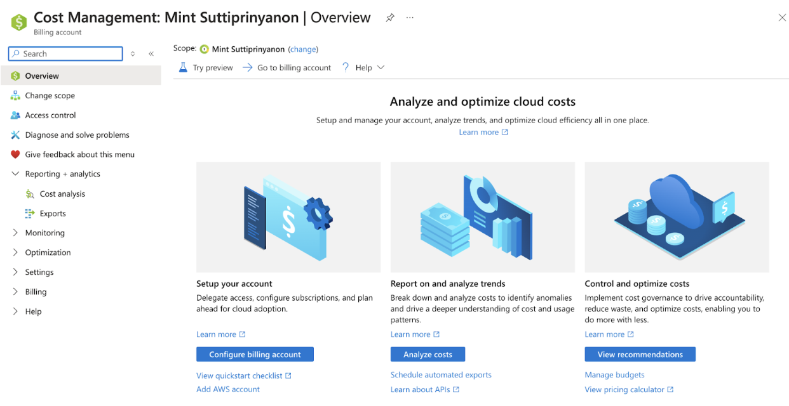
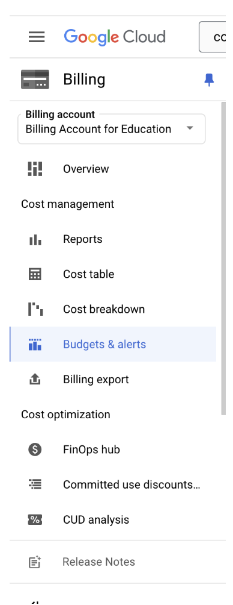
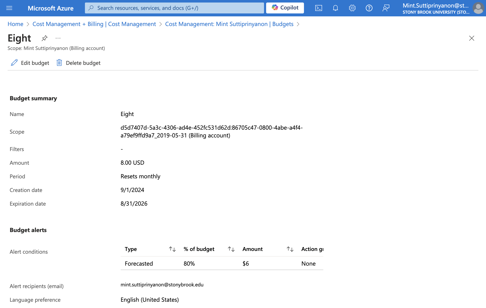
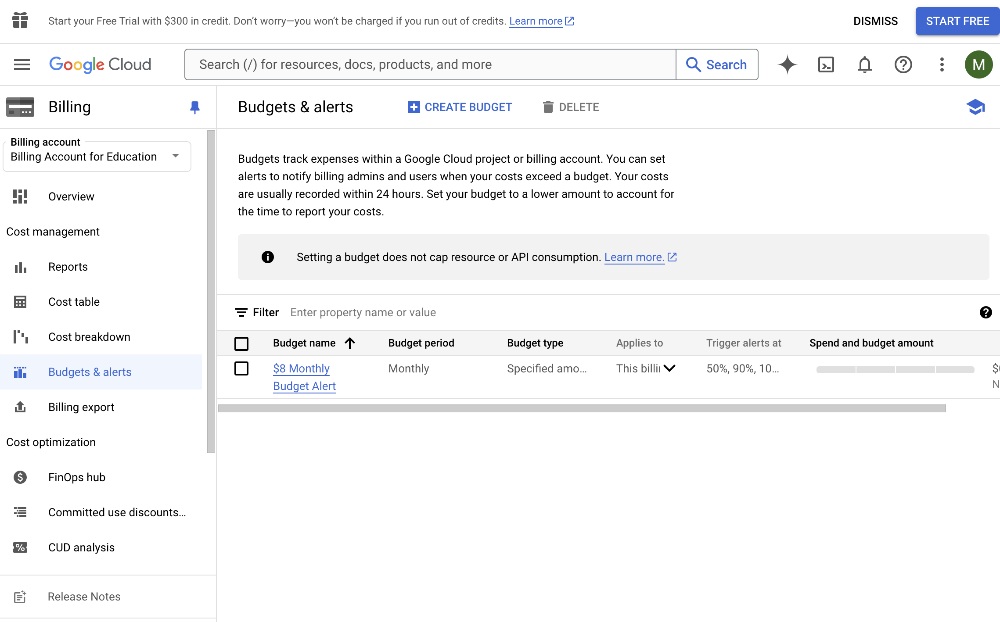
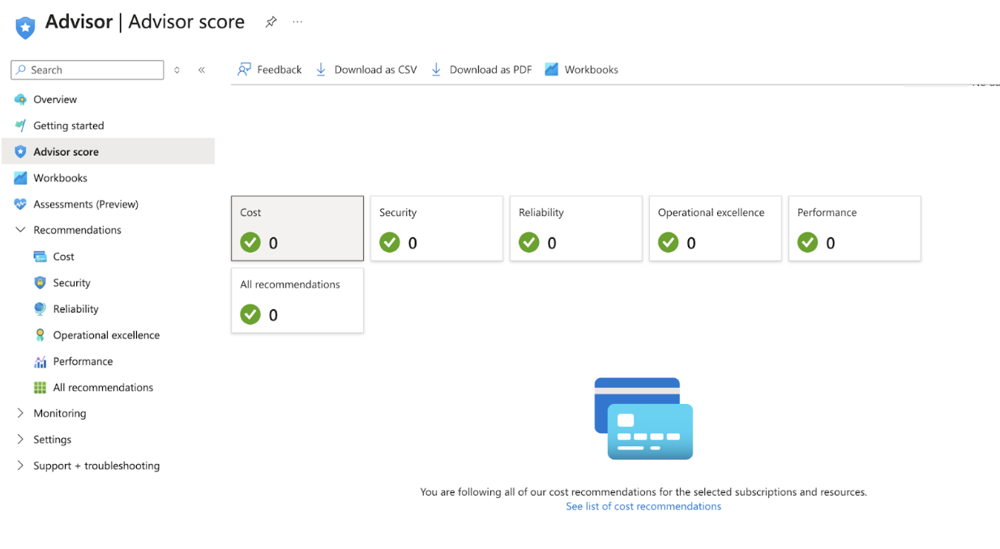
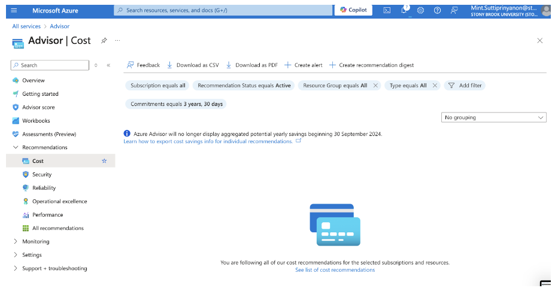

## Objective: 
#### Introduce the cost management and billing interfaces of Azure and Google Cloud Platform (GCP). To be able to navigate these platforms to understand how cloud costs are tracked and managed.

### 1. Explore the Cost Management Dashboard
  #### Azure
  - Through the Azure portal there was a “Cost Management + Billing” that can be searched through in services. To monitor costs, set budgets, and alerts, you would go to Cost management. There are 3 options that Microsoft gives to Analyze and optimize cloud costs.
    - First, a place to delegate access, configure subscriptions, and plan for cloud adoption.
    - Second, a place for reporting on and analyzing trends that can possibly help to identify anomalies.
    - Third, a place to control and optimize cost governance, hopefully to reduce waste and optimize costs

  
  #### GCP
  - In the Billing Account overview you can monitor costs, set budgets, and alerts. There are options on the sidebar to view reports, cost table, cost breakdown, and budgets & alerts. There is also a cost optimization tab.
    

### 2. Set Up a Hypothetical Budget
  #### Azure

  #### GCP
   

  
### 3. Investigate Cost Management Features
 #### Azure
  - Azure: the cost-saving recommendations appear in the Advisor-recommendations-cost options. There is also an Advisor score that can be helpful to see as a dashboard.

 #### GCP
  - Cost breakdown shows your base usage cost and how that cost was affected by any credits, adjustments, and taxes to arrive at your total cost. In the Dashboard section there are recommendations and also a section called “Top ways to save money”
    

