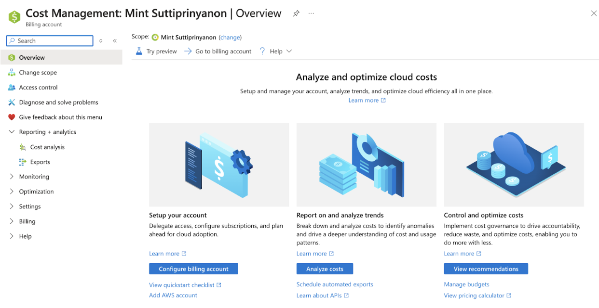

# Objective
## Introduce the cost management and billing interfaces of Azure and Google Cloud Platform (GCP). To be able to navigate these platforms to understand how cloud costs are tracked and managed.

### 1. Explore the Cost Management Dashboard
  #### Azure
  - Through the Azure portal there was a “Cost Management + Billing” that can be searched through in services. To monitor costs, set budgets, and alerts, you would go to Cost management. There are 3 options that Microsoft gives to Analyze and optimize cloud costs.
    - First to set up your account, where you can delegate access, configure subscriptions, and plan for cloud adoption.
    - Second, a place for reporting on and analyzing trends that can possibly help to identify anomalies.
    - Third, a place to control and optimize cost governance, hopefully to reduce waste and optimize costs

  
  #### GCP
    - 
### 2. Set Up a Hypothetical Budget
  #### Azure
  - A
  #### GCP
  
### 3. Investigate Cost Management Features
 #### Azure
  - A
  #### GCP

